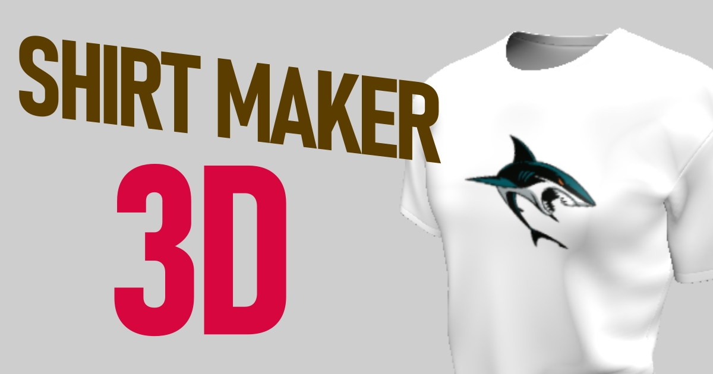
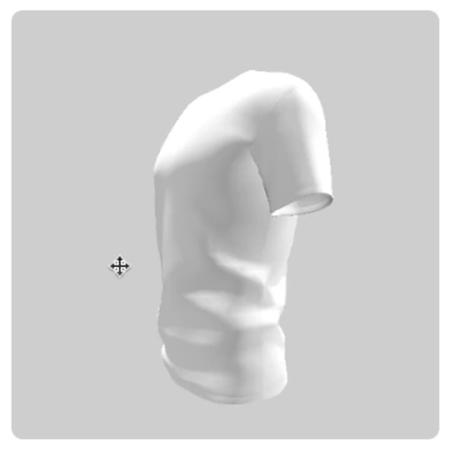
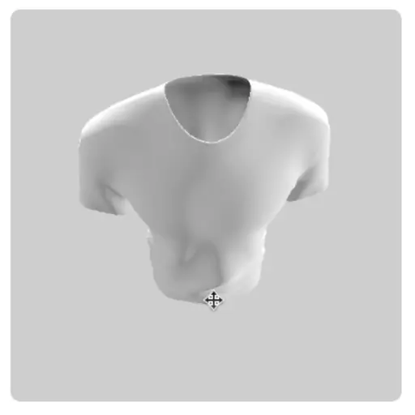
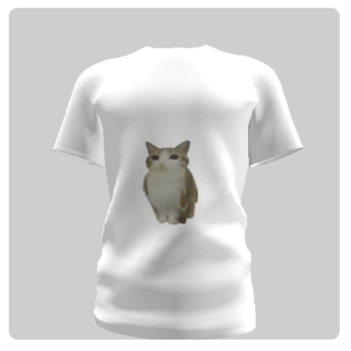
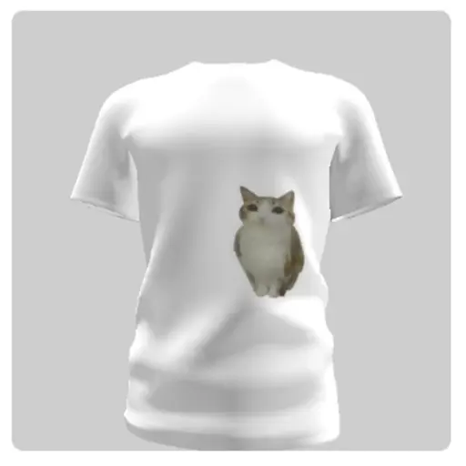
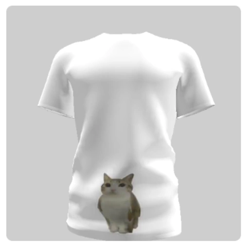
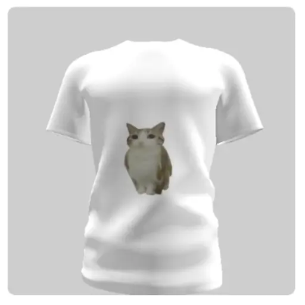

# Shirt Maker 3D

Welcome! **Shirt Maker 3D** is a website where you can make mockups of shirts with by uploading your own image. [Check it here](https://bastiasa.github.io/shirt_maker).

|  |  |  |
| - | - | - |
|  |  |  |

